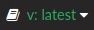

# CARLA文档

欢迎浏览CARLA文档.

这个是[CARLA文档](https://carla.readthedocs.io/)的中文翻译版本，欢迎大家跟我一起翻译这个文档

这个主页包含一个索引，其中包含文档中不同部分的简要描述。你可以随意按照自己喜欢的顺序阅读。但是无论如何，这里有一些对新人的建议.

* __安装 CARLA.__ 要么遵循[快速启动安装](start_quickstart.md)来获得CARLA发布，要么遵循[构建](build_linux.md)来获得所需平台.
* __使用 CARLA.__ 标题为[第一步](core_concepts.md)的章节介绍了最重要的概念.
* __查看 API.__ 有一个方便的[Python API参考](python_api.md)来查找可用的类和方法.

在阅读过程中，您可以在CARLA论坛上提出任何疑问或建议.

<a href="https://github.com/carla-simulator/carla/discussions/" target="_blank" class="btn btn-neutral" title="Go to the latest CARLA release">
CARLA forum</a>

 

!!! Warning
    __更改文档版本以适应您正在使用的CARLA版本__. 使用此窗口右下方的面板可以更改为以前的版本.__最新版本__ 指向`dev`分支中的文档，可能涉及当前正在开发且在任何 CARLA 打包版本中 __不可用__ 的功能，以及一般文档改进  __（这部分仅仅是翻译原文，由于本人能力有限，所以只翻译0.9.13版本的文档，其他版本的文档请查看原文）__.

---

## 入门指南

[__介绍__](start_introduction.md) — 对 CARLA 的预期。
[__快速入门软件包安装__](start_quickstart.md) — 获取 CARLA 发行版。

## 构建 CARLA

[__Linux 构建__](build_linux.md) — 在 Linux 上进行构建。
[__Windows 构建__](build_windows.md) — 在 Windows 上进行构建。
[__更新 CARLA__](build_update.md) — 获取最新内容。
[__构建系统__](build_system.md) — 了解构建及其制作过程。
[__Docker 中的 CARLA__](build_docker.md) — 使用容器解决方案运行 CARLA。
[__常见问题解答__](build_faq.md) — 一些最常见的安装问题。

## 第一步
[__核心概念__](core_concepts.md) — CARLA 基本概念概述。
[__第一步：世界和客户端__](core_world.md) — 管理和访问模拟。
[__第二步：角色和蓝图__](core_actors.md) — 了解角色及其处理方法。
[__第三步：地图和导航__](core_map.md) — 发现不同的地图以及车辆如何移动。
[__第四步：传感器和数据__](core_sensors.md) — 使用传感器检索模拟数据。

## 高级概念
[__OpenDRIVE 独立模式__](adv_opendrive.md) — 使用任何 OpenDRIVE 文件作为 CARLA 地图。
[__PTV-Vissim 协同仿真__](adv_ptv.md) — 在 CARLA 和 PTV-Vissim 之间运行同步模拟。
[__录制器__](adv_recorder.md) — 注册模拟中的事件并再次播放。
[__渲染选项__](adv_rendering_options.md) — 从质量设置到无渲染或离屏模式。
[__RSS__](adv_rss.md) — CARLA 客户端库中 RSS 的实现。
[__同步和时间步长__](adv_synchrony_timestep.md) — 客户端-服务器通信和模拟时间。
[__性能基准测试__](adv_benchmarking.md) — 使用我们准备的脚本执行基准测试。
[__CARLA 代理__](adv_agents.md) — 代理脚本允许单个车辆在地图上漫游或驾驶到设定目的地。

## 交通模拟

[__交通模拟概述__](ts_traffic_simulation_overview.md) — 为场景填充交通的不同可用选项概述。
[__交通管理器__](adv_traffic_manager.md) — 通过将车辆设置为自动驾驶模式来模拟城市交通。
[__SUMO 协同仿真__](adv_sumo.md) — 在 CARLA 和 SUMO 之间运行同步模拟。
[__Scenic__](tuto_G_scenic.md) — 按照使用 Scenic 库定义不同场景的示例。

## 参考资料
[__Python API 参考__](python_api.md) — Python API 中的类和方法。
[__蓝图库__](bp_library.md) — 用于生成角色的蓝图。
[__C++ 参考__](ref_cpp.md) — CARLA C++ 中的类和方法。
[__录制器二进制文件格式__](ref_recorder_binary_file_format.md) — 录制器文件格式的详细说明。
[__传感器参考__](ref_sensors.md) — 关于传感器及其检索数据的一切。

## 插件
[__carlaviz — 网页可视化工具__](plugins_carlaviz.md) — 监听模拟并在网页浏览器中显示场景和模拟数据的插件。

## ROS 桥接
[__ROS 桥接文档__](ros_documentation.md) — ROS 桥接的简要概述以及完整文档的链接。

## 自定义地图

[__CARLA 自定义地图概述__](tuto_M_custom_map_overview.md) — 添加自定义标准尺寸地图涉及的过程和选项概述。
[__在 RoadRunner 中创建地图__](tuto_M_generate_map.md) — 如何在 RoadRunner 中生成自定义标准尺寸地图。
[__导入地图至 CARLA 软件包__](tuto_M_add_map_package.md) — 如何将地图导入 CARLA 软件包。
[__导入地图至 CARLA 源码构建__](tuto_M_add_map_source.md) — 如何将地图导入从源码构建的 CARLA。
[__其他导入地图方法__](tuto_M_add_map_alternative.md) — 导入地图的其他方法。
[__手动准备地图包__](tuto_M_manual_map_package.md) — 如何准备用于手动导入的地图。
[__自定义地图：分层地图__](tuto_M_custom_layers.md) — 如何在自定义地图中创建子图层。
[__自定义地图：红绿灯和标志__](tuto_M_custom_add_tl.md) — 如何在自定义地图中添加红绿灯和标志。
[__自定义地图：道路绘制器__](tuto_M_custom_road_painter.md) — 如何使用道路绘制器工具更改道路外观。
[__自定义地图：程序化建筑物__](tuto_M_custom_buildings.md) — 为您的自定义地图填充建筑物。
[__自定义地图：天气和景观__](tuto_M_custom_weather_landscape.md) — 为您的自定义地图创建天气配置文件并填充景观。
[__生成行人导航__](tuto_M_generate_pedestrian_navigation.md) — 获取行人在周围移动所需的信息。

## 大型地图

[__大型地图概述__](large_map_overview.md) — CARLA 中大型地图工作原理的说明。
[__在 RoadRunner 中创建大型地图__](large_map_roadrunner.md) — 如何在 RoadRunner 中创建大型地图。
[__导入/打包大型地图__](large_map_import.md) — 如何导入大型地图。

## 教程 — 通用
[__添加摩擦力触发器__](tuto_G_add_friction_triggers.md) — 为车轮定义动态框触发器。
[__控制车辆物理特性__](tuto_G_control_vehicle_physics.md) — 对车辆物理特性进行运行时更改。
[__控制行人骨骼__](tuto_G_control_walker_skeletons.md) — 使用骨骼为行人制作动画。
[__使用 OpenStreetMap 生成地图__](tuto_G_openstreetmap.md) — 使用 OpenStreetMap 生成用于模拟的地图。
[__检索模拟数据__](tuto_G_retrieve_data.md) — 正确收集录制器数据的逐步指南。
[__CarSim 集成__](tuto_G_carsim_integration.md) — 关于如何使用 CarSim 车辆动力学引擎运行模拟的教程。
[__RLlib 集成__](tuto_G_rllib_integration.md) — 了解如何使用 RLlib 库运行您自己的实验。
[__Chrono 集成__](tuto_G_chrono.md) — 使用 Chrono 集成来模拟物理。
[__在 Docker 中构建 Unreal Engine 和 CARLA__](build_docker_unreal.md) — 在 Docker 中构建 Unreal Engine 和 CARLA。

## 教程 — 资产
[__添加新车辆__](tuto_A_add_vehicle.md) — 准备在 CARLA 中使用的车辆。
[__添加新道具__](tuto_A_add_props.md) — 向 CARLA 导入额外道具。
[__创建独立软件包__](tuto_A_create_standalone.md) — 生成并处理资产的独立软件包。
[__材质自定义__](tuto_A_material_customization.md) — 编辑车辆和建筑材质。

## 教程 — 开发者
[__如何升级内容__](tuto_D_contribute_assets.md) — 向 CARLA 添加新内容。
[__创建传感器__](tuto_D_create_sensor.md) — 开发在 CARLA 中使用的新传感器。
[__创建语义标签__](tuto_D_create_semantic_tags.md) — 为语义分割定义自定义标签。
[__自定义车辆悬挂__](tuto_D_customize_vehicle_suspension.md) — 修改车辆的悬挂系统。
[__生成详细碰撞体__](tuto_D_generate_colliders.md) — 为车辆创建详细碰撞体。
[__发布版本__](tuto_D_make_release.md) — 如何发布 CARLA 版本。

## CARLA 生态系统

[__Ansys 实时雷达模型__](ecosys_ansys.md) — 关于 Ansys RTR 研讨会的详细信息。

## 贡献
[__贡献指南__](cont_contribution_guidelines.md) — 贡献 CARLA 的不同方式。
[__行为准则__](cont_code_of_conduct.md) — 贡献者的标准权利和义务。
[__编码规范__](cont_coding_standard.md) — 编写正确代码的指南。
[__文档规范__](cont_doc_standard.md) — 编写正确文档的指南。
