# 录制器二进制文件格式

录制系统将回放模拟所需的所有信息保存在二进制文件中，多字节值使用小端（little endian）字节序。

*   [__1- 二进制中的字符串__](#1-strings-in-binary)  
*   [__2- 信息头__](#2-info-header)  
*   [__3- 数据包__](#3-packets)  
    *   [数据包 0 - 帧开始](#packet-0-frame-start)  
    *   [数据包 1 - 帧结束](#packet-1-frame-end)  
    *   [数据包 2 - 事件添加](#packet-2-event-add)  
    *   [数据包 3 - 事件删除](#packet-3-event-del)  
    *   [数据包 4 - 事件父级](#packet-4-event-parent)  
    *   [数据包 5 - 事件碰撞](#packet-5-event-collision)  
    *   [数据包 6 - 位置](#packet-6-position)  
    *   [数据包 7 - 交通灯](#packet-7-trafficlight)  
    *   [数据包 8 - 车辆动画](#packet-8-vehicle-animation)  
    *   [数据包 9 - 行人动画](#packet-9-walker-animation)  
*   [__4- 帧布局__](#4-frame-layout)  
*   [__5- 文件布局__](#5-file-layout)  

在下面代表文件格式的图像中，我们可以快速查看所有详细信息。图像中可视化的每个部分都将在以下章节中解释：

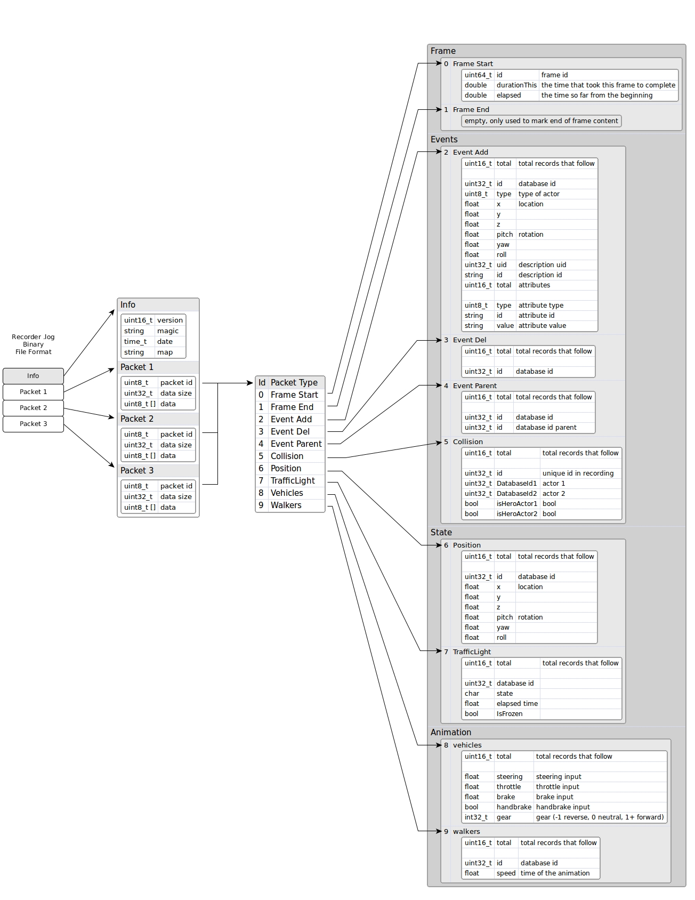

总而言之，该文件格式有一个包含一般信息（版本、魔术字符串、日期和所使用的地图）的小文件头，以及不同类型的数据包集合（目前我们使用 10 种类型，但将来会继续增加）。

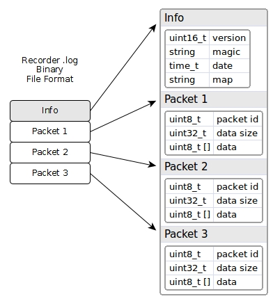

---
## 1- 二进制中的字符串

字符串编码时首先是其长度，然后是其字符，不带空字符结尾。例如，字符串 'Town06' 将保存为十六进制值：06 00 54 6f 77 6e 30 36

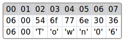

---
## 2- 信息头

信息头包含关于录制文件的通用信息。基本上，它包含版本和用于将文件标识为录制文件的魔术字符串。如果文件头发生变化，则版本也会发生变化。此外，它还包含一个日期时间戳（从 1900 年纪元开始的秒数），以及一个包含用于录制的地图名称的字符串。

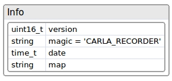

信息头示例如下：

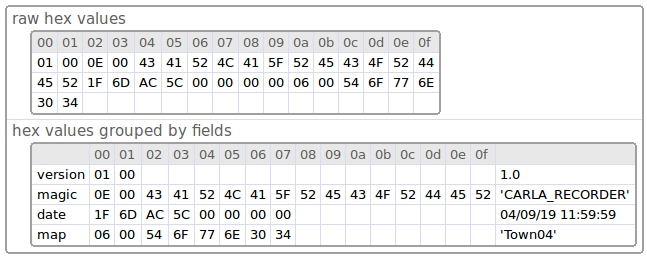

---
## 3- 数据包

每个数据包都以一个包含两个字段（5 字节）的小包头开始：

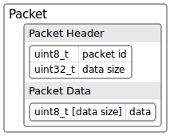

* **id**: 数据包类型
* **size**: 数据包数据的大小

包头信息后面跟着 **数据**。
**数据** 是可选的，**size** 为 0 表示数据包中没有 **数据**。
如果 **size** 大于 0，则表示数据包包含 **数据** 字节。因此，需要根据数据包的类型重新解释 **数据**。

数据包的包头非常有用，因为我们在回放时可以忽略那些不感兴趣的数据包。我们只需要读取数据包的包头（前 5 个字节）并跳过数据包的数据即可跳转到下一个数据包：

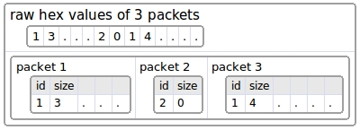

数据包的类型有：

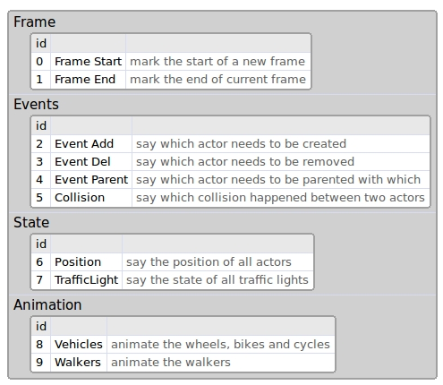

我们建议用户自定义数据包使用 100 以上的 **id**，因为此列表在将来会继续增加。

### 数据包 0 - 帧开始

该数据包标志着新帧的开始，它是每一帧开始的第一个数据包。
所有数据包都需要放置在 **帧开始** 和 **帧结束** 之间。

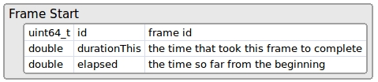

所以，elapsed + durationThis = 下一帧的经过时间

### 数据包 1 - 帧结束

此帧没有数据，它仅标志当前帧的结束。这有助于回放器在下一帧开始之前知道每一帧的结束。
通常，下一帧应该是帧开始数据包。

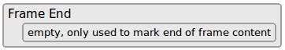

### 数据包 2 - 事件添加

该数据包说明我们在当前帧需要创建多少个角色。

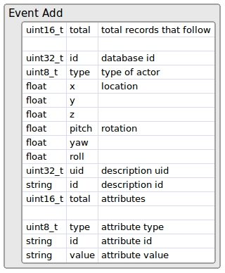

**total** 字段说明后面有多少条记录。每条记录以 **id** 字段开始，这是录制时角色的 ID（在回放时该 ID 可能会在内部更改，但我们需要使用此 ID）。角色的 **type** 可以具有以下可能的值：

  * 0 = 其他 (Other)
  * 1 = 车辆 (Vehicle)
  * 2 = 行人 (Walker)
  * 3 = 交通灯 (TrafficLight)
  * 4 = 无效 (INVALID)

之后，是我们要创建角色的 **location** (位置) 和 **rotation** (旋转)。

紧接着是角色的 **description** (描述)。描述 **uid** 是描述的数字 ID，**id** 是文本 ID，例如 'vehicle.seat.leon'。

然后是其 **attributes** (属性) 集合，如颜色、轮数、角色等。属性的数量是可变的，看起来应该类似于：

* number_of_wheels = 4
* sticky_control = true
* color = 79,33,85
* role_name = autopilot

### 数据包 3 - 事件删除

该数据包说明本帧需要销毁多少个角色。

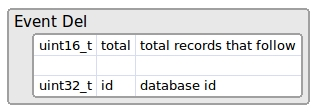

它具有记录的 **total** (总数)，每条记录都有要删除角色的 **id**。

例如，此数据包可能如下所示：

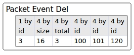

数字 3 将数据包标识为（事件删除）。数字 16 是数据包数据的大小（4 个字段，每个字段 4 字节）。因此，如果我们不想处理此数据包，我们可以跳过接下来的 16 个字节，直接到达下一个数据包的开始。
接下来的 3 说明后面跟随的总记录数，每条记录是要删除角色的 ID。
因此，我们需要在本帧删除角色 100、101 和 120。

### 数据包 4 - 事件父级

该数据包说明哪个角色是另一个角色（父级）的子级。

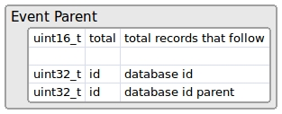

第一个 ID 是子角色，第二个 ID 将是父角色。

### 数据包 5 - 事件碰撞

如果两个角色之间发生碰撞，它将记录在此数据包中。目前只有带有碰撞传感器的角色才会报告碰撞，因此目前只有英雄车辆会自动附加该传感器。

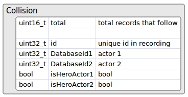

**id** 只是用于在内部标识每次碰撞的序列。
同一对角色之间在同一帧内可能会发生多次碰撞，因为物理帧速率是固定的，通常在同一个渲染帧中有多个物理子步。

### 数据包 6 - 位置

该数据包记录场景中存在的所有 **车辆 (vehicle)** 和 **行人 (walker)** 类型角色的位置和朝向。

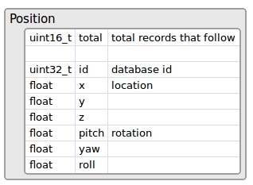

### 数据包 7 - 交通灯

该数据包记录场景中所有 **交通灯 (traffic lights)** 的状态。这意味着它存储了状态（红、橙或绿）以及等待切换到新状态的时间。

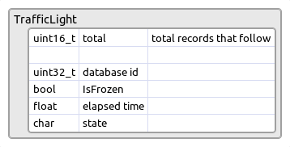

### 数据包 8 - 车辆动画

该数据包记录车辆、自行车和摩托车的动画。此数据包存储 **throttle** (油门), **steering** (转向), **brake** (刹车), **handbrake** (手刹) 和 **gear** (档位) 输入，然后在回放时设置它们。

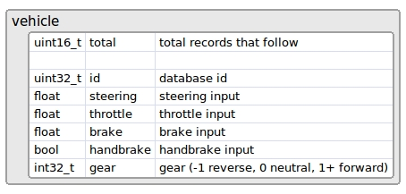

### 数据包 9 - 行人动画

该数据包记录行人的动画。它只保存动画中使用的行人 **speed** (速度)。

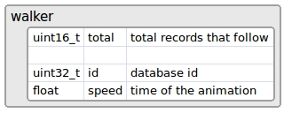

---
## 4- 帧布局

一帧由几个数据包组成，其中所有数据包都是可选的，除了在该帧中具有 **开始** 和 **结束** 的数据包，它们必须始终存在。

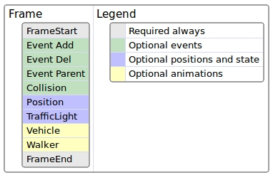

**事件 (Event)** 数据包仅存在于它们发生的帧中。

**位置 (Position)** 和 **交通灯 (traffic light)** 数据包应该存在于所有帧中，因为移动所有角色和设置交通灯状态需要它们。它们是可选的，但如果它们不存在，则回放器将无法移动角色或设置交通灯的状态。

**动画 (animation)** 数据包也是可选的，但默认情况下会记录它们。这样行人就有动画，车辆轮子也会跟随车辆的方向。

---
## 5- 文件布局

文件的布局以 **信息头 (info header)** 开始，然后是一组一组的数据包集合。每组中的第一个是 **帧开始 (Frame Start)** 数据包，每组中的最后一个是 **帧结束 (Frame End)** 数据包。在两者之间，我们也可以找到其余的数据包。

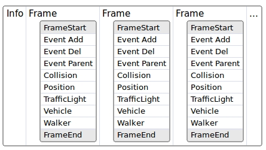

通常，首先放置所有关于事件的数据包，然后再放置关于位置和状态的数据包是一个好主意。

事件数据包是可选的，因为它们在发生时出现，所以我们可以有一个像这样的布局：

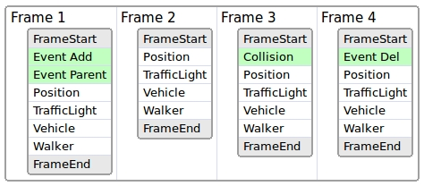

在 **第 1 帧** 中创建了一些角色并重新指定了父级，因此我们可以在图像中观察到其事件。
在 **第 2 帧** 中没有事件。在 **第 3 帧** 中一些角色发生了碰撞，因此出现了带有该信息的碰撞事件。在 **第 4 帧** 中角色被销毁。
