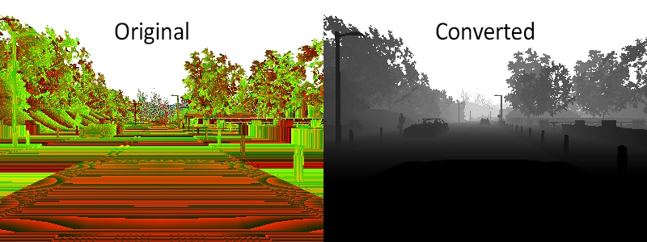
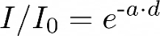
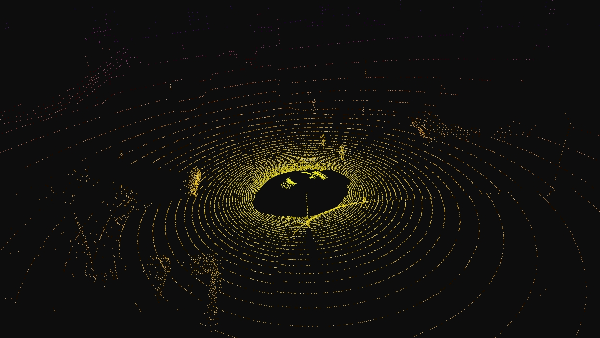
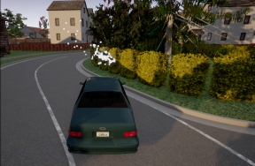
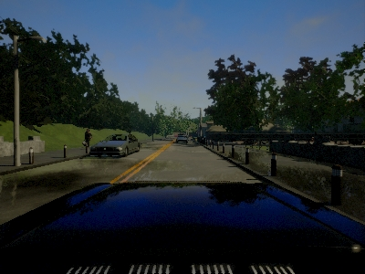
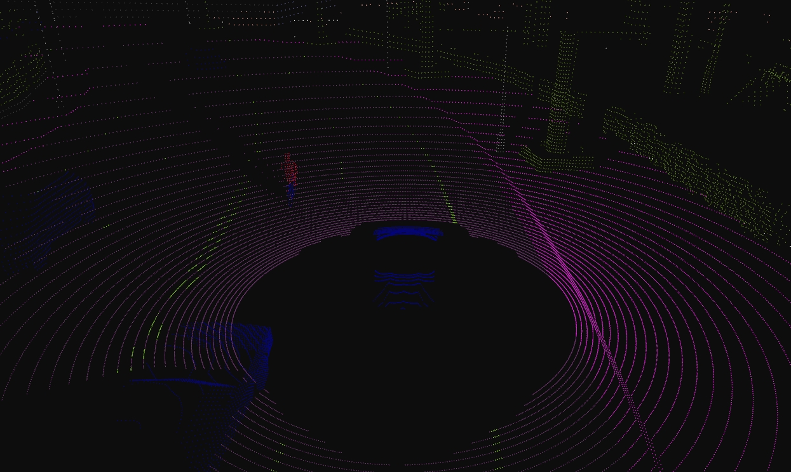
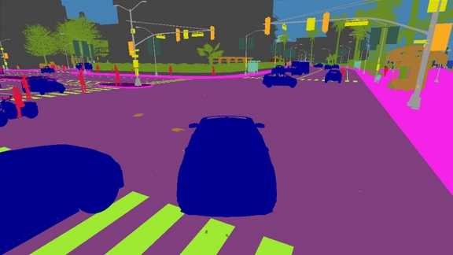
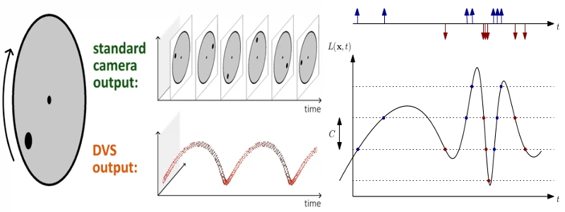
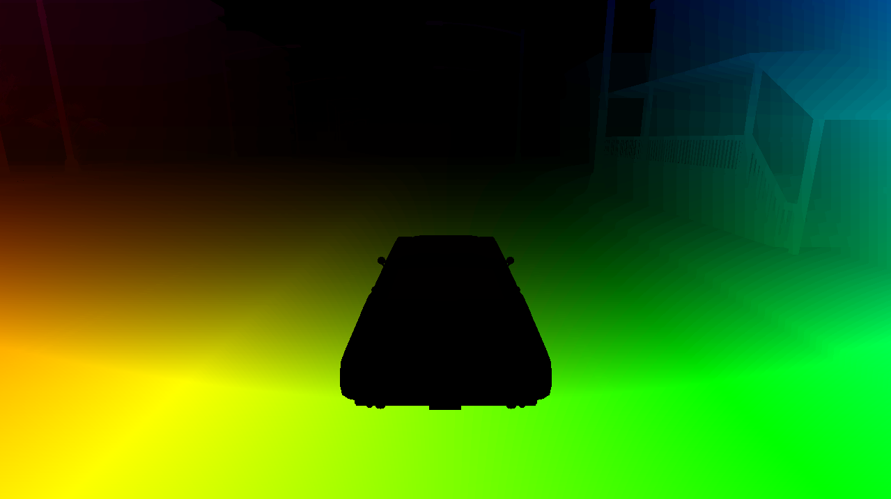

# 传感器参考

- [__碰撞检测器__](#collision-detector)
- [__深度相机__](#depth-camera)
- [__GNSS 传感器__](#gnss-sensor)
- [__IMU 传感器__](#imu-sensor)
- [__车道侵入检测器__](#lane-invasion-detector)
- [__激光雷达 (LIDAR) 传感器__](#lidar-sensor)
- [__障碍物检测器__](#obstacle-detector)
- [__雷达传感器__](#radar-sensor)
- [__RGB 相机__](#rgb-camera)
- [__RSS 传感器__](#rss-sensor)
- [__语义激光雷达传感器__](#semantic-lidar-sensor)
- [__语义分割相机__](#semantic-segmentation-camera)
- [__DVS 相机__](#dvs-camera)
- [__光流相机__](#optical-flow-camera)

!!! Important
    所有传感器都使用虚幻引擎（UE）坐标系（__x__-*轴向前*，__y__-*轴向右*，__z__-*轴向上*），并返回局部空间坐标。在使用任何可视化软件时，请注意其坐标系。许多软件会反转 Y 轴，因此直接可视化传感器数据可能会导致镜像输出。

---
## 碰撞检测器

* __蓝图：__ sensor.other.collision
* __输出：__ 每次碰撞产生一个 [carla.CollisionEvent](python_api.md#carla.CollisionEvent)。

该传感器在其父角色与世界中的任何物体发生碰撞时注册一个事件。在单个模拟步骤中可能会检测到多次碰撞。
为了确保能检测到与任何类型物体的碰撞，服务器会为建筑物或灌木丛等元素创建“虚拟”角色，以便可以检索语义标签来识别它。

碰撞检测器没有任何可配置属性。

#### 输出属性

| 传感器数据属性            | 类型  | 描述        |
| ----------------------- | ----------------------- | ----------------------- |
| `frame`            | int   | 进行测量时的帧号。      |
| `timestamp`        | double | 自剧集开始以来测量时的模拟时间（以秒为单位）。        |
| `transform`        | [carla.Transform](<../python_api#carlatransform>)  | 测量时传感器在世界坐标系中的位置和旋转。 |
| `actor`            | [carla.Actor](<../python_api#carlaactor>)    | 测量碰撞的角色（传感器的父级）。           |
| `other_actor`      | [carla.Actor](<../python_api#carlaactor>)    | 与父角色发生碰撞的另一个角色。      |
| `normal_impulse`     | [carla.Vector3D](<../python_api#carlavector3d>)    | 碰撞产生的法向冲量。      |

---
## 深度相机

* __蓝图：__ sensor.camera.depth
* __输出：__ 每步（除非 `sensor_tick` 另有说明）产生一个 [carla.Image](python_api.md#carla.Image)。

该相机提供场景的原始数据，对每个像素到相机的距离进行编码（也称为 **深度缓冲区** 或 **z 缓冲区**），以创建元素的深度图。

图像使用 RGB 颜色空间的 3 个通道对每个像素的深度值进行编码，字节从低到高依次为：_R -> G -> B_。实际距离（单位：米）可以通过以下公式解码：

```
normalized = (R + G * 256 + B * 256 * 256) / (256 * 256 * 256 - 1)
in_meters = 1000 * normalized
```

输出的 [carla.Image](python_api.md#carla.Image) 应使用 [carla.colorConverter](python_api.md#carla.ColorConverter) 保存到磁盘，它将存储在 RGB 通道中的距离转换为包含距离的 __[0,1]__ 浮点数，然后将其转换为灰度图。
[carla.colorConverter](python_api.md#carla.ColorConverter) 中有两个选项可以获取深度视图：__Depth__ 和 __Logarithmic depth__。两者的精度都是毫米级的，但对数方法为较近的物体提供了更好的结果。

```py
...
raw_image.save_to_disk("path/to/save/converted/image", carla.Depth)
```



#### 基础相机属性

| 蓝图属性       | 类型    | 默认值 | 描述   |
| ----------------------------- | ----------------------------- | ----------------------------- | ----------------------------- |
| `image_size_x`            | int     | 800     | 图像宽度（像素）。      |
| `image_size_y`            | int     | 600     | 图像高度（像素）。     |
| `fov`   | float   | 90\.0   | 水平视野（度）。    |
| `sensor_tick` | float   | 0\.0    | 传感器采集之间的模拟秒数（滴答）。 |

#### 相机镜头畸变属性

| 蓝图属性      | 类型         | 默认值      | 描述  |
| ------------------------- | ------------------------- | ------------------------- | ------------------------- |
| `lens_circle_falloff`    | float        | 5\.0         | 范围：[0.0, 10.0]       |
| `lens_circle_multiplier` | float        | 0\.0         | 范围：[0.0, 10.0]       |
| `lens_k`     | float        | \-1.0        | 范围：[-inf, inf]       |
| `lens_kcube` | float        | 0\.0         | 范围：[-inf, inf]       |
| `lens_x_size`            | float        | 0\.08        | 范围：[0.0, 1.0]        |
| `lens_y_size`            | float        | 0\.08        | 范围：[0.0, 1.0]        |

#### 输出属性

| 传感器数据属性            | 类型  | 描述        |
| ----------------------- | ----------------------- | ----------------------- |
| `frame`            | int   | 进行测量时的帧号。      |
| `timestamp`        | double | 自剧集开始以来测量时的模拟时间（以秒为单位）。        |
| `transform`        | [carla.Transform](<../python_api#carlatransform>)  | 测量时传感器在世界坐标系中的位置和旋转。 |
| `width`            | int   | 图像宽度（像素）。           |
| `height`           | int   | 图像高度（像素）。          |
| `fov` | float | 水平视野（度）。         |
| `raw_data`         | bytes | BGRA 32 位像素数组。     |

---
## GNSS 传感器

* __蓝图：__ sensor.other.gnss
* __输出：__ 每步（除非 `sensor_tick` 另有说明）产生一个 [carla.GNSSMeasurement](python_api.md#carla.GnssMeasurement)。

报告其父对象的当前 [GNSS 位置](https://www.gsa.europa.eu/european-gnss/what-gnss)。这是通过将度量位置添加到 OpenDRIVE 地图定义中定义的初始地理参考位置来计算的。

#### GNSS 属性

| 蓝图属性      | 类型   | 默认值            | 描述        |
| ------------------- | ------------------- | ------------------- | ------------------- |
| `noise_alt_bias`   | float  | 0\.0   | 海拔噪声模型中的均值参数。    |
| `noise_alt_stddev` | float  | 0\.0   | 海拔噪声模型中的标准差参数。  |
| `noise_lat_bias`   | float  | 0\.0   | 纬度噪声模型中的均值参数。    |
| `noise_lat_stddev` | float  | 0\.0   | 纬度噪声模型中的标准差参数。  |
| `noise_lon_bias`   | float  | 0\.0   | 经度噪声模型中的均值参数。   |
| `noise_lon_stddev` | float  | 0\.0   | 经度噪声模型中的标准差参数。 |
| `noise_seed`       | int    | 0      | 伪随机数生成器的初始化种子。   |
| `sensor_tick`      | float  | 0\.0   | 传感器采集之间的模拟秒数（滴答）。            |

<br>

#### 输出属性

| 传感器数据属性            | 类型  | 描述        |
| ----------------------- | ----------------------- | ----------------------- |
| `frame`            | int   | 进行测量时的帧号。      |
| `timestamp`        | double | 自剧集开始以来测量时的模拟时间（以秒为单位）。        |
| `transform`        | [carla.Transform](<../python_api#carlatransform>)  | 测量时传感器在世界坐标系中的位置和旋转。 |
| `latitude`         | double | 角色的纬度。           |
| `longitude`        | double | 角色的经度。          |
| `altitude`         | double | 角色的海拔。           |

---
## IMU 传感器

* __蓝图：__ sensor.other.imu
* __输出：__ 每步（除非 `sensor_tick` 另有说明）产生一个 [carla.IMUMeasurement](python_api.md#carla.IMUMeasurement)。

提供加速度计、陀螺仪和指南针对父对象检索的测量值。数据是从对象的当前状态收集的。

#### IMU 属性

| 蓝图属性 | 类型    | 默认值             | 描述         |
| -------------------------------- | -------------------------------- | -------------------------------- | -------------------------------- |
| `noise_accel_stddev_x`          | float   | 0\.0    | 加速度噪声模型中的标准差参数（X 轴）。  |
| `noise_accel_stddev_y`          | float   | 0\.0    | 加速度噪声模型中的标准差参数（Y 轴）。  |
| `noise_accel_stddev_z`          | float   | 0\.0    | 加速度噪声模型中的标准差参数（Z 轴）。  |
| `noise_gyro_bias_x` | float   | 0\.0    | 陀螺仪噪声模型中的均值参数（X 轴）。   |
| `noise_gyro_bias_y` | float   | 0\.0    | 陀螺仪噪声模型中的均值参数（Y 轴）。   |
| `noise_gyro_bias_z` | float   | 0\.0    | 陀螺仪噪声模型中的均值参数（Z 轴）。   |
| `noise_gyro_stddev_x`           | float   | 0\.0    | 陀螺仪噪声模型中的标准差参数（X 轴）。 |
| `noise_gyro_stddev_y`           | float   | 0\.0    | 陀螺仪噪声模型中的标准差参数（Y 轴）。 |
| `noise_gyro_stddev_z`           | float   | 0\.0    | 陀螺仪噪声模型中的标准差参数（Z 轴）。 |
| `noise_seed`        | int     | 0       | 伪随机数生成器的初始化种子。    |
| `sensor_tick`       | float   | 0\.0    | 传感器采集之间的模拟秒数（滴答）。             |

<br>

#### 输出属性

| 传感器数据属性            | 类型  | 描述        |
| ----------------------- | ----------------------- | ----------------------- |
| `frame`            | int   | 进行测量时的帧号。      |
| `timestamp`        | double | 自剧集开始以来测量时的模拟时间（以秒为单位）。        |
| `transform`        | [carla.Transform](<../python_api#carlatransform>)  | 测量时传感器在世界坐标系中的位置和旋转。 |
| `accelerometer`      | [carla.Vector3D](<../python_api#carlavector3d>)    | 测量线性加速度，单位为 `m/s^2`。     |
| `gyroscope`        | [carla.Vector3D](<../python_api#carlavector3d>)    | 测量角速度，单位为 `rad/sec`。      |
| `compass`          | float | 弧度制方向。在 UE 中，正北为 `(0.0, -1.0, 0.0)`。       |

---
## 车道侵入检测器

* __蓝图：__ sensor.other.lane_invasion
* __输出：__ 每次越线产生一个 [carla.LaneInvasionEvent](python_api.md#carla.LaneInvasionEvent)。

每当其父级跨越车道线时注册一个事件。
该传感器使用地图的 OpenDRIVE 描述提供的道路数据，通过考虑车轮之间的空间来确定父车辆是否侵入另一条车道。
但是，有一些事项需要考虑：

* OpenDRIVE 文件与地图之间的差异会导致不规则现象，例如跨越地图中不可见的线。
* 输出检索的是跨越的车道线列表：计算是在 OpenDRIVE 中完成的，并将四个车轮之间的整个空间视为一个整体。因此，可能会同时跨越多个车道线。

该传感器没有任何可配置属性。

!!! Important
    该传感器完全在客户端运行。

#### 输出属性

| 传感器数据属性            | 类型  | 描述        |
| ----------------------- | ----------------------- | ----------------------- |
| `frame`            | int   | 进行测量时的帧号。      |
| `timestamp`        | double | 自剧集开始以来测量时的模拟时间（以秒为单位）。        |
| `transform`        | [carla.Transform](<../python_api#carlatransform>)  | 测量时传感器在世界坐标系中的位置和旋转。 |
| `actor`            | [carla.Actor](<../python_api#carlaactor>)    | 侵入另一条车道的车辆（父角色）。  |
| `crossed_lane_markings`          | list([carla.LaneMarking](<../python_api#carlalanemarking>))      | 已跨越的车道线列表。      |

---
## 激光雷达 (LIDAR) 传感器

* __蓝图：__ sensor.lidar.ray_cast
* __输出：__ 每步（除非 `sensor_tick` 另有说明）产生一个 [carla.LidarMeasurement](python_api.md#carla.LidarMeasurement)。

该传感器模拟使用射线投射（ray-casting）实现的旋转激光雷达。
通过为垂直 FOV 中分布的每个通道添加一束激光来计算点。通过计算激光雷达在一帧中旋转的水平角度来模拟旋转。通过在每一步中对每束激光进行射线投射来计算点云。
`points_per_channel_each_step = points_per_second / (FPS * channels)`

激光雷达测量包含一个数据包，其中包含在 `1/FPS` 间隔内生成的所有点。在此间隔内物理状态不会更新，因此测量中的所有点都反映了场景的同一张“静态图片”。

此输出包含模拟点云，因此可以迭代它以检索其 [`carla.Location`](python_api.md#carla.Location) 列表：

```py
for location in lidar_measurement:
    print(location)
```

激光雷达测量的信息是编码后的 4D 点。前三个是 xyz 坐标中的空间点，最后一个是行程中的强度损失。该强度通过以下公式计算。
<br>


`a` — 衰减系数。这可能取决于传感器的波长和大气条件。它可以使用激光雷达属性 `atmosphere_attenuation_rate` 进行修改。
`d` — 击中点到传感器的距离。

为了获得更好的现实感，可以丢弃点云中的点。这是模拟由于外部干扰导致损失的一种简单方法。可以通过结合两种不同的方式来完成：

*   __通用丢弃（General drop-off）__ — 随机丢弃点的比例。这是在追踪之前完成的，这意味着丢弃的点不会被计算，从而提高了性能。如果 `dropoff_general_rate = 0.5`，则一半的点将被丢弃。
*   __基于强度的丢弃（Intensity-based drop-off）__ — 对于检测到的每个点，根据计算出的强度以概率执行额外的丢弃。该概率由两个参数决定。`dropoff_zero_intensity` 是强度为零的点被丢弃的概率。`dropoff_intensity_limit` 是一个强度阈值，高于此阈值的点不会被丢弃。范围内点被丢弃的概率是基于这两个参数的线性比例。

此外，`noise_stddev` 属性创建了一个噪声模型，用于模拟现实传感器中出现的意外偏差。对于正值，每个点沿激光射线向量随机扰动。结果是一个具有完美角度定位但距离测量存在噪声的激光雷达传感器。

可以调整激光雷达的旋转，使其在每个模拟步骤中覆盖特定的角度（使用 [固定时间步长](adv_synchrony_timestep.md)）。例如，为了每步旋转一次（输出完整的圆，如下图所示），旋转频率和模拟 FPS 应相等。<br> __1.__ 设置传感器的频率 `sensors_bp['lidar'][0].set_attribute('rotation_frequency','10')`。<br> __2.__ 使用 `python3 config.py --fps=10` 运行模拟。



#### 激光雷达属性

| 蓝图属性  | 类型   | 默认值    | 描述     |
| ----------------------------------------------------------------- | ----------------------------------------------------------------- | ----------------------------------------------------------------- | ----------------------------------------------------------------- |
| `channels`         | int    | 32     | 激光束数量。  |
| `range`            | float  | 10.0  | 最大测量/射线投射距离（米）。（CARLA 0.9.6 或之前版本为厘米）。  |
| `points_per_second` | int    | 56000  | 所有激光器每秒生成的点数。    |
| `rotation_frequency`            | float  | 10.0  | 激光雷达旋转频率。       |
| `upper_fov`        | float  | 10.0  | 最高激光束的角度（度）。        |
| `lower_fov`        | float  | -30.0 | 最低激光束的角度（度）。         |
| `horizontal_fov`   | float | 360.0 | 水平视野（度），0 - 360。 |
| `atmosphere_attenuation_rate`     | float  | 0.004 | 衡量每米激光雷达强度损失的系数。请查看上方的强度计算公式。 |
| `dropoff_general_rate`          | float  | 0.45  | 随机丢弃点的通用比例。    |
| `dropoff_intensity_limit`       | float  | 0.8   | 对于基于强度的丢弃，强度高于此值的点不会被丢弃。    |
| `dropoff_zero_intensity`        | float  | 0.4   | 对于基于强度的丢弃，强度为零的每个点被丢弃的概率。    |
| `sensor_tick`      | float  | 0.0   | 传感器采集之间的模拟秒数（滴答）。 |
| `noise_stddev`     | float  | 0.0   | 用于沿射线投射向量扰动每个点的噪声模型的标准差。 |

#### 输出属性

| 传感器数据属性            | 类型  | 描述        |
| ----------------------- | ----------------------- | ----------------------- |
| `frame`            | int   | 进行测量时的帧号。      |
| `timestamp`        | double | 自剧集开始以来测量时的模拟时间（以秒为单位）。        |
| `transform`        | [carla.Transform](<../python_api#carlatransform>)  | 测量时传感器在世界坐标系中的位置和旋转。 |
| `horizontal_angle`   | float | 当前帧中激光雷达在 XY 平面上的角度（弧度）。           |
| `channels`         | int   | 激光雷达的通道（激光束）数量。    |
| `get_point_count(channel)`       | int   | 本帧捕获的每个通道的点数。  |
| `raw_data`         | bytes | 32 位浮点数数组（每个点的 XYZI）。      |

<br>

---
## 障碍物检测器

* __蓝图：__ sensor.other.obstacle
* __输出：__ 每个障碍物产生一个 [carla.ObstacleDetectionEvent](python_api.md#carla.ObstacleDetectionEvent)（除非 `sensor_tick` 另有说明）。

每当父角色前方有障碍物时注册一个事件。
为了预判障碍物，传感器在父车辆前方创建一个胶囊形状，并使用它来检查碰撞。
为了确保能检测到与任何类型物体的碰撞，服务器会为建筑物或灌木丛等元素创建“虚拟”角色，以便可以检索语义标签来识别它。

| 蓝图属性          | 类型       | 默认值    | 描述      |
| -------------------------------- | -------------------------------- | -------------------------------- | -------------------------------- |
| `distance` | float      | 5          | 追踪距离。           |
| `hit_radius`     | float      | 0\.5       | 追踪半径。         |
| `only_dynamics`  | bool       | False      | 如果为真，追踪将仅考虑动态对象。 |
| `debug_linetrace` | bool       | False      | 如果为真，追踪线将可见。        |
| `sensor_tick`    | float      | 0\.0       | 传感器采集之间的模拟秒数（滴答）。    |

<br>

#### 输出属性

| 传感器数据属性            | 类型  | 描述        |
| ----------------------- | ----------------------- | ----------------------- |
| `frame`            | int   | 进行测量时的帧号。      |
| `timestamp`        | double | 自剧集开始以来测量时的模拟时间（以秒为单位）。        |
| `transform`        | [carla.Transform](<../python_api#carlatransform>)  | 测量时传感器在世界坐标系中的位置和旋转。 |
| `actor`            | [carla.Actor](<../python_api#carlaactor>)    | 检测到障碍物的角色（父角色）。   |
| `other_actor`      | [carla.Actor](<../python_api#carlaactor>)    | 被检测为障碍物的角色。   |
| `distance`         | float | 从 `actor` 到 `other_actor` 的距离。      |

<br>

---
## 雷达传感器

* __蓝图：__ sensor.other.radar
* __输出：__ 每步（除非 `sensor_tick` 另有说明）产生一个 [carla.RadarMeasurement](python_api.md#carla.RadarMeasurement)。

传感器创建一个锥形视图，该视图被转换为视线内元素的 2D 点图以及它们相对于传感器的速度。这可用于塑造元素形状并评估它们的运动和方向。由于使用极坐标，点将集中在视图中心周围。

测量的点包含在 [carla.RadarMeasurement](python_api.md#carla.RadarMeasurement) 中，作为一个 [carla.RadarDetection](python_api.md#carla.RadarDetection) 数组，其中指定了它们的极坐标、距离和速度。
雷达传感器提供的原始数据可以轻松转换为 __numpy__ 可管理的格式：
```py
# 获取一个 numpy [[vel, azimuth, altitude, depth],...[,,,]]:
points = np.frombuffer(radar_data.raw_data, dtype=np.dtype('f4'))
points = np.reshape(points, (len(radar_data), 4))
```

提供的脚本 `manual_control.py` 使用此传感器显示检测到的点，并在静态时将其涂成白色，向对象移动时涂成红色，远离时涂成蓝色：



| 蓝图属性       | 类型    | 默认值 | 描述   |
| ----------------------------- | ----------------------------- | ----------------------------- | ----------------------------- |
| `horizontal_fov`          | float   | 30\.0   | 水平视野（度）。    |
| `points_per_second`       | int     | 1500    | 所有激光器每秒生成的点数。          |
| `range` | float   | 100     | 最大测量/射线投射距离（米）。      |
| `sensor_tick` | float   | 0\.0    | 传感器采集之间的模拟秒数（滴答）。 |
| `vertical_fov`            | float   | 30\.0   | 垂直视野（度）。      |

<br>

#### 输出属性

| 传感器数据属性 | 类型            | 描述     |
| ---------------- | ---------------- | ---------------- |
| `raw_data`      | [carla.RadarDetection](<../python_api#carlaradardetection>) | 检测到的点列表。      |

<br>

| RadarDetection 属性    | 类型             | 描述      |
| ---------------------------- | ---------------------------- | ---------------------------- |
| `altitude`       | float            | 仰角（弧度）。   |
| `azimuth`        | float            | 方位角（弧度）。    |
| `depth`          | float            | 距离（米）。          |
| `velocity`       | float            | 朝向传感器的速度。 |

---
## RGB 相机

* __蓝图：__ sensor.camera.rgb
* __输出：__ 每步（除非 `sensor_tick` 另有说明）产生一个 [carla.Image](python_api.md#carla.Image)。

“RGB”相机充当普通相机，捕获场景图像。
[carla.colorConverter](python_api.md#carla.ColorConverter)

如果启用了 `enable_postprocess_effects`，则会为了真实感对图像应用一组后期处理效果：

* __晕影（Vignette）：__ 使屏幕边缘变暗。
* __颗粒抖动（Grain jitter）：__ 为渲染添加一些噪声。
* __泛光（Bloom）：__ 强光会灼伤周围区域。
* __自动曝光（Auto exposure）：__ 修改图像伽马值以模拟人眼对黑暗或明亮区域的适应。
* __镜头光晕（Lens flares）：__ 模拟镜头上明亮物体的反射。
* __景深（Depth of field）：__ 模糊靠近相机或离相机非常远的物体。

`sensor_tick` 表示我们希望传感器捕获数据的频率。
值为 1.5 意味着我们希望传感器每隔一秒半捕获一次数据。默认值 0.0 意味着尽可能快。



#### 基础相机属性

<br>

| 蓝图属性  | 类型     | 默认值  | 描述          |
| ----------------------------------------------------- | ----------------------------------------------------- | ----------------------------------------------------- | ----------------------------------------------------- |
| `bloom_intensity`    | float    | 0\.675   | 泛光后期处理效果的强度，`0.0` 为禁用。         |
| `fov`    | float    | 90\.0    | 水平视野（度）。   |
| `fstop`  | float    | 1\.4     | 相机镜头的光圈。孔径为 `1/fstop`，典型的镜头可低至 f/1.2（更大的孔径）。较大的数值将减弱景深效果。 |
| `image_size_x`       | int      | 800      | 图像宽度（像素）。           |
| `image_size_y`       | int      | 600      | 图像高度（像素）。          |
| `iso`    | float    | 100\.0   | 相机传感器感光度。   |
| `gamma`  | float    | 2\.2     | 相机的目标伽马值。      |
| `lens_flare_intensity`           | float    | 0\.1     | 镜头光晕后期处理效果的强度，`0.0` 为禁用。    |
| `sensor_tick`        | float    | 0\.0     | 传感器采集之间的模拟秒数（滴答）。  |
| `shutter_speed`      | float    | 200\.0   | 相机快门速度，单位为秒 (1.0/s)。       |

#### 相机镜头畸变属性

<br>

| 蓝图属性      | 类型         | 默认值      | 描述  |
| ------------------------------------------------------- | ------------------------------------------------------- | ------------------------------------------------------- | ------------------------------------------------------- |
| `lens_circle_falloff`    | float        | 5\.0         | 范围：[0.0, 10.0]       |
| `lens_circle_multiplier` | float        | 0\.0         | 范围：[0.0, 10.0]       |
| `lens_k`     | float        | \-1.0        | 范围：[-inf, inf]       |
| `lens_kcube` | float        | 0\.0         | 范围：[-inf, inf]       |
| `lens_x_size`            | float        | 0\.08        | 范围：[0.0, 1.0]        |
| `lens_y_size`            | float        | 0\.08        | 范围：[0.0, 1.0]        |

#### 高级相机属性

由于这些效果是由 UE 提供的，请务必查看其文档：

  * [自动曝光 (Automatic Exposure)][AutomaticExposure.Docs]
  * [电影级景深方法 (Cinematic Depth of Field Method)][CinematicDOFMethod.Docs]
  * [颜色分级和电影级色调映射器 (Color Grading and Filmic Tonemapper)][ColorGrading.Docs]

[AutomaticExposure.Docs]: https://docs.unrealengine.com/en-US/Engine/Rendering/PostProcessEffects/AutomaticExposure/index.html
[CinematicDOFMethod.Docs]: https://docs.unrealengine.com/en-US/Engine/Rendering/PostProcessEffects/DepthOfField/CinematicDOFMethods/index.html
[ColorGrading.Docs]: https://docs.unrealengine.com/en-US/Engine/Rendering/PostProcessEffects/ColorGrading/index.html

| 蓝图属性  | 类型           | 默认值        | 描述    |
| ------------------------------------------------------------- | ------------------------------------------------------------- | ------------------------------------------------------------- | ------------------------------------------------------------- |
| `min_fstop`    | float          | 1\.2           | 最大光圈。    |
| `blade_count`  | int            | 5  | 组成光圈机构的叶片数量。     |
| `exposure_mode`      | str            | `histogram`    | 可以是 `manual` 或 `histogram`。更多信息见 [UE4 文档](<https://docs.unrealengine.com/en-US/Engine/Rendering/PostProcessEffects/AutomaticExposure/index.html>)。  |
| `exposure_compensation`          | float          | **Linux:** \+0.75<br>**Windows:** 0\.0        | 曝光的对数调整。0：不调整，-1：暗 2 倍，-2：暗 4 倍，1：亮 2 倍，2：亮 4 倍。   |
| `exposure_min_bright`            | float          | 10\.0           | 在 `exposure_mode: "histogram"` 中。自动曝光的最小亮度。人眼可以适应的最低亮度。必须大于 0 且小于或等于 `exposure_max_bright`。  |
| `exposure_max_bright`            | float          | 12\.0           | 在 `exposure_mode: "histogram"` 中。自动曝光的最大亮度。人眼可以适应的最高亮度。必须大于 0 且大于或等于 `exposure_min_bright`。          |
| `exposure_speed_up`  | float          | 3\.0           | 在 `exposure_mode: "histogram"` 中。从黑暗环境到明亮环境的适应速度。  |
| `exposure_speed_down`            | float          | 1\.0           | 在 `exposure_mode: "histogram"` 中。从明亮环境到黑暗环境的适应速度。  |
| `calibration_constant`           | float          | 16\.0          | 18% 反照率的校准常数。           |
| `focal_distance`     | float          | 1000\.0        | 景深效果应清晰的距离。单位为厘米 (UE 单位)。           |
| `blur_amount`  | float          | 1\.0           | 运动模糊的强度。             |
| `blur_radius`  | float          | 0\.0           | 1080p 分辨率下的像素半径，用于根据与相机的距离模拟大气散射。           |
| `motion_blur_intensity`          | float          | 0\.45          | 运动模糊强度 [0,1]。     |
| `motion_blur_max_distortion`       | float          | 0\.35          | 运动模糊造成的最大失真。屏幕宽度的百分比。       |
| `motion_blur_min_object_screen_size`           | float          | 0\.1           | 物体必须具备的屏幕宽度百分比才能产生运动模糊，较低的值意味着较少的绘制调用。  |
| `slope`        | float          | 0\.88          | 色调映射器 S 曲线的陡度。较大的值使斜率更陡（更暗）[0.0, 1.0]。  |
| `toe`          | float          | 0\.55          | 调整色调映射器中的暗色 [0.0, 1.0]。           |
| `shoulder`     | float          | 0\.26          | 调整色调映射器中的亮色 [0.0, 1.0]。         |
| `black_clip`   | float          | 0\.0           | 不应调整此项。设置交叉点以及黑色调开始切断其值的位置 [0.0, 1.0]。            |
| `white_clip`   | float          | 0\.04          | 设置交叉点以及白色调开始切断其值的位置。在大多数情况下有微妙的变化 [0.0, 1.0]。             |
| `temp`         | float          | 6500\.0        | 与场景中光线温度相关的白平衡。**白光：** 当此值与光线温度匹配时。**暖光：** 当高于场景中的光线时，呈黄色。**冷光：** 当低于光线时，呈蓝色。     |
| `tint`         | float          | 0\.0           | 白平衡温度色调。调整青色和品红色范围。这应与白平衡 Temp 属性一起使用以获得准确的颜色。在某些光温下，颜色可能会显得更黄或更蓝。这可用于平衡结果颜色，使其看起来更自然。 |
| `chromatic_aberration_intensity`   | float          | 0\.0           | 控制颜色偏移的缩放因子，在屏幕边缘更明显。      |
| `chromatic_aberration_offset`      | float          | 0\.0           | 发生效果的图像中心归一化距离。          |
| `enable_postprocess_effects`       | bool           | True           | 后期处理效果激活。   |

<br>

[AutomaticExposure.gamesetting]: https://docs.unrealengine.com/en-US/Engine/Rendering/PostProcessEffects/AutomaticExposure/index.html#gamesetting

#### 输出属性

| 传感器数据属性            | 类型  | 描述        |
| ----------------------- | ----------------------- | ----------------------- |
| `frame`            | int   | 进行测量时的帧号。      |
| `timestamp`        | double | 自剧集开始以来测量时的模拟时间（以秒为单位）。        |
| `transform`        | [carla.Transform](<../python_api#carlatransform>)  | 测量时传感器在世界坐标系中的位置和旋转。 |
| `width`            | int   | 图像宽度（像素）。           |
| `height`           | int   | 图像高度（像素）。          |
| `fov` | float | 水平视野（度）。         |
| `raw_data`         | bytes | BGRA 32 位像素数组。     |

---
## RSS 传感器

*   __蓝图：__ sensor.other.rss
*   __输出：__ 每步（除非 `sensor_tick` 另有说明）产生一个 [carla.RssResponse](python_api.md#carla.RssResponse)。

!!! Important
    强烈建议在阅读本节之前先阅读具体的 [RSS 文档](adv_rss.md)。

该传感器在 CARLA 中集成了 [Intel 的责任敏感安全 C++ 库 (ad-rss-lib)](https://github.com/intel/ad-rss-lib)。它在 CARLA 中默认禁用，必须明确构建才能使用。

RSS 传感器计算车辆的 RSS 状态，并检索当前的 RSS 响应作为传感器数据。[carla.RssRestrictor](python_api.md#carla.RssRestrictor) 将使用这些数据在将其应用于车辆之前调整 [carla.VehicleControl](python_api.md#carla.VehicleControl)。

这些控制器可以由 *自动驾驶* 堆栈或用户输入生成。例如，下面是 `PythonAPI/examples/rss/manual_control_rss.py` 中的一段代码，必要时使用 RSS 修改用户输入。

__1.__ 检查 __RssSensor__ 是否生成了包含限制的有效响应。
__2.__ 收集车辆的当前动力学和车辆物理特性。
__3.__ 使用来自 RssSensor 的响应以及车辆当前的动力学和物理特性对车辆控制应用限制。

```py
rss_proper_response = self._world.rss_sensor.proper_response if self._world.rss_sensor and self._world.rss_sensor.response_valid else None
if rss_proper_response:
...
        vehicle_control = self._restrictor.restrict_vehicle_control(
            vehicle_control, rss_proper_response, self._world.rss_sensor.ego_dynamics_on_route, self._vehicle_physics)
```

#### carla.RssSensor 类

该传感器的蓝图没有可修改的属性。但是，它实例化的 [carla.RssSensor](python_api.md#carla.RssSensor) 对象具有 Python API 参考中详述的属性和方法。以下是它们的摘要。

| [carla.RssSensor 变量](<../python_api#carlarsssensor>)     | 类型    | 描述         |
| ---------------------------------------- | ---------------------------------------- | ---------------------------------------- |
| `ego_vehicle_dynamics`    | [ad.rss.world.RssDynamics](<https://intel.github.io/ad-rss-lib/ad_rss/Appendix-ParameterDiscussion/>)  | 应用于主车的 RSS 参数    |
| `other_vehicle_dynamics`  | [ad.rss.world.RssDynamics](<https://intel.github.io/ad-rss-lib/ad_rss/Appendix-ParameterDiscussion/>)  | 应用于其他车辆的 RSS 参数 |
| `pedestrian_dynamics`     | [ad.rss.world.RssDynamics](<https://intel.github.io/ad-rss-lib/ad_rss/Appendix-ParameterDiscussion/>)  | 应用于行人的 RSS 参数        |
| `road_boundaries_mode`    | [carla.RssRoadBoundariesMode](<../python_api#carlarssroadboundariesmode>)      | 启用/禁用 [留在道路上](<https://intel.github.io/ad-rss-lib/ad_rss_map_integration/HandleRoadBoundaries>) 功能。默认为 **Off**。 |

<br>

```py
# rss_sensor.py 的片段
# carla.RssSensor 在监听新的 carla.RssResponse 时更新
def _on_rss_response(weak_self, response):
...
        self.timestamp = response.timestamp
        self.response_valid = response.response_valid
        self.proper_response = response.proper_response
        self.ego_dynamics_on_route = response.ego_dynamics_on_route
        self.rss_state_snapshot = response.rss_state_snapshot
        self.situation_snapshot = response.situation_snapshot
        self.world_model = response.world_model
```

!!! Warning
    该传感器完全在客户端运行。服务器中没有蓝图。对属性的更改将在调用 *listen()* __之后__ 生效。

此类中可用的方法与车辆的路由有关。RSS 计算始终基于主车在道路网络中的路线。

传感器允许通过提供一些关键点来控制所考虑的路线，这些点可以是 [carla.Waypoint](python_api.md#carla.Waypoint) 中的 [carla.Transform](python_api.md#carla.Transform)。最好选择交叉路口之后的这些点，以强制路线进行所需的转弯。

| [carla.RssSensor 方法](<../python_api#carlarsssensor>)     | 描述       |
| ----------------------------------------- | ----------------------------------------- |
| `routing_targets` | 获取当前用于路由的目标列表。       |
| `append_routing_target` | 在当前路由目标中添加一个位置。 |
| `reset_routing_targets` | 删除已添加的路由目标。             |
| `drop_route`      | 丢弃当前路线并创建新路线。 |
| `register_actor_constellation_callback`           | 注册回调以自定义计算。            |
| `set_log_level`   | 设置日志级别。     |
| `set_map_log_level`     | 设置地图相关日志的日志级别。     |

<br>

---

```py
# 更新当前路线
self.sensor.reset_routing_targets()
if routing_targets:
    for target in routing_targets:
        self.sensor.append_routing_target(target)
```

!!! Note
    如果没有定义路由目标，则会创建一条随机路线。

#### 输出属性

| [carla.RssResponse 属性](<../python_api#carlarssresponse>)           | 类型  | 描述       |
| ------------------------------------- | ------------------------------------- | ------------------------------------- |
| `response_valid`  | bool  | 响应数据的有效性。      |
| `proper_response` | [ad.rss.state.ProperResponse](<https://intel.github.io/ad-rss-lib/doxygen/ad_rss/structad_1_1rss_1_1state_1_1ProperResponse.html>)   | RSS 为车辆计算的适当响应，包括加速度限制。         |
| `rss_state_snapshot`    | [ad.rss.state.RssStateSnapshot](<https://intel.github.io/ad-rss-lib/doxygen/ad_rss/structad_1_1rss_1_1state_1_1RssStateSnapshot.html>)           | 当前时间点的 RSS 状态。这是 RSS 计算的详细个体输出。  |
| `situation_snapshot`    | [ad.rss.situation.SituationSnapshot](<https://intel.github.io/ad-rss-lib/doxygen/ad_rss/structad_1_1rss_1_1situation_1_1SituationSnapshot.html>) | 当前时间点的 RSS 情况。这是 RSS 计算的经过处理的输入数据。    |
| `world_model`     | [ad.rss.world.WorldModel](<https://intel.github.io/ad-rss-lib/doxygen/ad_rss/structad_1_1rss_1_1world_1_1WorldModel.html>)           | 当前时间点的 RSS 世界模型。这是 RSS 计算的输入数据。       |
| `ego_dynamics_on_route` | [carla.RssEgoDynamicsOnRoute](<../python_api#carlarssegodynamicsonroute>)    | 关于路线的当前主车动力学。 |

如果注册了 actor_constellation_callback，则会针对以下情况触发调用：

1. 默认计算 (`actor_constellation_data.other_actor=None`)
2. 针对每个角色的计算

```py
# rss_sensor.py 的片段
# 该函数注册为 actor_constellation_callback
def _on_actor_constellation_request(self, actor_constellation_data):
    actor_constellation_result = carla.RssActorConstellationResult()
    actor_constellation_result.rss_calculation_mode = ad.rss.map.RssMode.NotRelevant
    actor_constellation_result.restrict_speed_limit_mode = ad.rss.map.RssSceneCreation.RestrictSpeedLimitMode.IncreasedSpeedLimit10
    actor_constellation_result.ego_vehicle_dynamics = self.current_vehicle_parameters
    actor_constellation_result.actor_object_type = ad.rss.world.ObjectType.Invalid
    actor_constellation_result.actor_dynamics = self.current_vehicle_parameters

    actor_id = -1
    actor_type_id = "none"
    if actor_constellation_data.other_actor != None:
        # 为特定角色自定义 actor_constellation_result
        ...
    else:
        # 默认
        ...
    return actor_constellation_result
```

---
## 语义激光雷达传感器

* __蓝图：__ sensor.lidar.ray_cast_semantic
* __输出：__ 每步（除非 `sensor_tick` 另有说明）产生一个 [carla.SemanticLidarMeasurement](python_api.md#carla.SemanticLidarMeasurement)。

该传感器模拟使用射线投射实现的旋转激光雷达，它公开了关于射线投射击中的所有信息。其行为与 [激光雷达传感器](#lidar-sensor) 非常相似，但它们之间有两个主要区别。

*   语义激光雷达检索的原始数据每个点包含更多数据。
	*   点的坐标（与普通激光雷达相同）。
	*   入射角与击中表面法线之间的余弦值。
	*   实例和语义真值（Ground-truth）。基本上是击中的 CARLA 对象的索引及其语义标签。
*   语义激光雷达不包括强度、丢弃或噪声模型属性。

通过为垂直 FOV 中分布的每个通道添加一束激光来计算点。通过计算激光雷达在一帧中旋转的水平角度来模拟旋转。通过在每一步中对每束激光进行射线投射来计算点云。
```sh
points_per_channel_each_step = points_per_second / (FPS * channels)
```

激光雷达测量包含一个数据包，其中包含在 `1/FPS` 间隔内生成的所有点。在此间隔内物理状态不会更新，因此测量中的所有点都反映了场景的同一张“静态图片”。

此输出包含激光雷达语义检测点云，因此可以迭代它以检索其 [`carla.SemanticLidarDetection`](python_api.md#carla.SemanticLidarDetection) 列表：

```py
for detection in semantic_lidar_measurement:
    print(detection)
```

可以调整激光雷达的旋转，使其在每个模拟步骤中覆盖特定的角度（使用 [固定时间步长](adv_synchrony_timestep.md)）。例如，为了每步旋转一次（输出完整的圆，如下图所示），旋转频率和模拟 FPS 应相等。<br>
__1.__ 设置传感器的频率 `sensors_bp['lidar'][0].set_attribute('rotation_frequency','10')`。<br>
__2.__ 使用 `python3 config.py --fps=10` 运行模拟。



#### 语义激光雷达属性

<br>

| 蓝图属性  | 类型           | 默认值 | 描述    |
| ------------------------------------- | ------------------ | ------------------- | ------------------------------------- |
| `channels`         | int   | 32    | 激光束数量。  |
| `range`            | float | 10.0 | 最大测量/射线投射距离（米）。（CARLA 0.9.6 或之前版本为厘米）。 |
| `points_per_second`    | int   | 56000 | 所有激光器每秒生成的点数。   |
| `rotation_frequency`   | float | 10.0 | 激光雷达旋转频率。       |
| `upper_fov`        | float | 10.0 | 最高激光束的角度（度）。    |
| `lower_fov`        | float | -30.0 | 最低激光束的角度（度）。     |
| `horizontal_fov`   | float | 360.0 | 水平视野（度），0 - 360。 |
| `sensor_tick`      | float | 0.0  | 传感器采集之间的模拟秒数（滴答）。   |

<br>

#### 输出属性

| 传感器数据属性  | 类型           | 描述    |
| ------------------------------------- | ------------------------------------- | ------------------------------------- |
| `frame`        | int            | 进行测量时的帧号。  |
| `timestamp`    | double         | 自剧集开始以来测量时的模拟时间（以秒为单位）。   |
| `transform`    | [carla.Transform](<../python_api#carlatransform>)     | 测量时传感器在世界坐标系中的位置和旋转。 |
| `horizontal_angle`         | float          | 当前帧中激光雷达在 XY 平面上的角度（弧度）。     |
| `channels`     | int            | 激光雷达的通道（激光束）数量。      |
| `get_point_count(channel)` | int            | 当前帧中捕获的每个通道的点数。            |
| `raw_data`     | bytes          | 包含带有实例和语义信息的点云数组。对于每个点，存储四个 32 位浮点数。<br> XYZ 坐标。<br> 入射角的余弦值。<br> 包含击中对象索引的无符号整数。<br> 包含对象语义标签的无符号整数。 |

---
## 语义分割相机

*   __蓝图：__ sensor.camera.semantic_segmentation
*   __输出：__ 每步（除非 `sensor_tick` 另有说明）产生一个 [carla.Image](python_api.md#carla.Image)。

此相机通过根据标签以不同颜色显示视线中的每个物体来对其进行分类（例如，行人以与车辆不同的颜色显示）。
当模拟开始时，场景中的每个元素都会带有标签创建。当一个角色被生成时也是如此。这些对象根据它们在项目中的相对文件路径进行分类。例如，存储在 `Unreal/CarlaUE4/Content/Static/Pedestrians` 中的网格被标记为 `Pedestrian`。



服务器提供一张标签信息 __编码在红色通道中__ 的图像：红色通道值为 `x` 的像素属于标签为 `x` 的对象。
可以存储此原始 [carla.Image](python_api.md#carla.Image)，并在 [carla.ColorConverter](python_api.md#carla.ColorConverter) 中借助 __CityScapesPalette__ 对其进行转换，以应用标签信息并显示带有语义分割的图片。

```py
...
raw_image.save_to_disk("path/to/save/converted/image", carla.cityScapesPalette)
```

目前提供以下标签：

| 数值          | 标签            | 转换后的颜色  | 描述      |
| ----------------------------------- | ----------------------------------- | ----------------------------------- | ----------------------------------- |
| `0`            | Unlabeled      | `(0, 0, 0)`      | 未分类的元素被视为 `Unlabeled`。此类通常为空，或者至少包含没有碰撞的元素。     |
| `1`            | Building       | `(70, 70, 70)`   | 建筑物（如房屋、摩天大楼……）及其附属元素。 <br> 例如：空调、脚手架、遮阳篷、梯子等。       |
| `2`            | Fence          | `(100, 40, 40)`  | 栅栏、栏杆或其他直立结构。基本上是围合一块地面的木质或金属网组件。           |
| `3`            | Other          | `(55, 90, 80)`   | 不属于任何其他类别的所有事物。       |
| `4`            | Pedestrian       | `(220, 20, 60)`  | 步行或乘坐/驾驶任何类型车辆或移动系统的人类。 <br> 例如：自行车或滑板车、滑板、马、滚轴溜冰鞋、轮椅等。         |
| `5`            | Pole           | `(153, 153, 153)`            | 主要是垂直方向的小型杆子。如果杆子有水平部分（通常用于红绿灯杆），也被视为杆子。 <br> 例如：标志杆、红绿灯杆。     |
| `6`            | RoadLine       | `(157, 234, 50)`             | 道路上的标记。    |
| `7`            | Road           | `(128, 64, 128)`             | 汽车通常行驶的地面部分。 <br> 例如：任何方向的车道和街道。       |
| `8`            | SideWalk       | `(244, 35, 232)`             | 为行人或骑行者指定的地面部分。通过某些障碍物（如路缘或杆子）与道路隔开，而不仅仅是通过标记。该标签包括可能的界限路缘、交通岛（步行部分）和步行区。 |
| `9`            | Vegetation       | `(107, 142, 35)`             | 树木、对冲、各种垂直植被。地表植被被视为 `Terrain`。   |
| `10`           | Vehicles       | `(0, 0, 142)`    | 汽车、面包车、卡车、摩托车、自行车、公交车、火车。       |
| `11`           | Wall           | `(102, 102, 156)`            | 独立的立墙。不属于建筑物的一部分。         |
| `12`           | TrafficSign      | `(220, 220, 0)`  | 由国家/城市管理部门安装的标志，通常用于交通监管。此类不包括安装标志的杆子。 <br> 例如：交通标志、停车标志、方向标志……     |
| `13`           | Sky            | `(70, 130, 180)`             | 开阔的天空。包括云和太阳。   |
| `14`           | Ground         | `(81, 0, 81)`    | 不符合任何其他类别的任何水平地面结构。例如车辆和行人共享的区域，或者由路缘与道路隔开的平坦环岛。        |
| `15`           | Bridge         | `(150, 100, 100)`            | 仅桥梁结构。上面的栅栏、人、车辆和其他元素被单独标记。          |
| `16`           | RailTrack      | `(230, 150, 140)`            | 汽车不可行驶的所有类型的铁轨。 <br> 例如：地铁和火车轨道。    |
| `17`           | GuardRail      | `(180, 165, 180)`            | 所有类型的护栏/防撞栏。 |
| `18`           | TrafficLight     | `(250, 170, 30)`             | 不带杆子的红绿灯箱体。 |
| `19`           | Static         | `(110, 190, 160)`            | 场景中不可移动的元素和道具。 <br> 例如：消防栓、固定长凳、喷泉、公交站等。    |
| `20`           | Dynamic        | `(170, 120, 50)`             | 位置随时间变化的元素。 <br> 例如：可移动垃圾桶、小推车、包、轮椅、动物等。         |
| `21`           | Water          | `(45, 60, 150)`  | 水平水面。 <br> 例如：湖泊、海洋、河流。   |
| `22`           | Terrain        | `(145, 170, 100)`            | 草、地表植被、土壤或沙子。这些区域不适合驾驶。该标签包括可能的界限路缘。      |

<br>

!!! Note
    阅读 [本教程](tuto_D_create_semantic_tags.md) 以创建新的语义标签。

#### 基础相机属性

| 蓝图属性       | 类型    | 默认值 | 描述   |
| ----------------------------- | ----------------------------- | ----------------------------- | ----------------------------- |
| `fov`   | float   | 90\.0   | 水平视野（度）。    |
| `image_size_x`            | int     | 800     | 图像宽度（像素）。      |
| `image_size_y`            | int     | 600     | 图像高度（像素）。     |
| `sensor_tick` | float   | 0\.0    | 传感器采集之间的模拟秒数（滴答）。 |

---

#### 相机镜头畸变属性

| 蓝图属性      | 类型         | 默认值      | 描述  |
| ---------------------------- | ---------------------------- | ---------------------------- | ---------------------------- |
| `lens_circle_falloff`    | float        | 5\.0         | 范围：[0.0, 10.0]       |
| `lens_circle_multiplier` | float        | 0\.0         | 范围：[0.0, 10.0]       |
| `lens_k`     | float        | \-1.0        | 范围：[-inf, inf]       |
| `lens_kcube` | float        | 0\.0         | 范围：[-inf, inf]       |
| `lens_x_size`            | float        | 0\.08        | 范围：[0.0, 1.0]        |
| `lens_y_size`            | float        | 0\.08        | 范围：[0.0, 1.0]        |

---

#### 输出属性

| 传感器数据属性            | 类型  | 描述        |
| ----------------------- | ----------------------- | ----------------------- |
| `fov` | float | 水平视野（度）。         |
| `frame`            | int   | 进行测量时的帧号。      |
| `height`           | int   | 图像高度（像素）。          |
| `raw_data`         | bytes | BGRA 32 位像素数组。     |
| `timestamp`        | double | 自剧集开始以来测量时的模拟时间（以秒为单位）。        |
| `transform`        | [carla.Transform](<../python_api#carlatransform>)  | 测量时传感器在世界坐标系中的位置和旋转。 |
| `width`            | int   | 图像宽度（像素）。           |

---
## DVS 相机

*   __蓝图：__ sensor.camera.dvs
*   __输出：__ 每步（除非 `sensor_tick` 另有说明）产生一个 [carla.DVSEventArray](python_api.md#carla.DVSEventArray)。

动态视觉传感器 (DVS) 或事件相机是一种工作方式与传统相机截然不同的传感器。事件相机不是以固定速率捕获强度图像，而是以事件流的形式异步测量强度变化，事件流编码了每个像素的亮度变化。与标准相机相比，事件相机具有独特的特性。它们具有非常高的动态范围（140 dB 对比 60 dB）、无运动模糊和高时间分辨率（微秒级）。因此，事件相机即使在具有挑战性的高速场景和高动态范围环境中也能提供高质量的视觉信息，为基于视觉的算法开辟了新的应用领域。

DVS 相机输出事件流。当对数强度 `L` 的变化达到预定义的恒定阈值 `C`（通常在 15% 到 30% 之间）时，会在像素 `x`, `y` 处在时间戳 `t` 触发一个事件 `e=(x,y,t,pol)`。

``
L(x,y,t) - L(x,y,t-\delta t) = pol C
``

`t-\delta t` 是该像素处触发上一个事件的时间，`pol` 是根据亮度变化符号确定的事件极性。亮度增加时极性为正 `+1`，亮度降低时极性为负 `-1`。其工作原理如下图所示。标准相机以固定速率输出帧，因此在场景中没有运动时会发送冗余信息。相比之下，事件相机是数据驱动的传感器，对亮度变化具有微秒级延迟的响应。在图中，只要单维度 `x` 在时间 `t` 上的（带符号）亮度变化超过对比度阈值 `C` ，就会生成正（或负）事件（蓝色点或红色点）。观察信号快速变化时事件率是如何增长的。



当前 DVS 相机的实现是以两个连续同步帧之间的均匀采样方式工作的。因此，为了模拟真实事件相机的高时间分辨率（微秒级），传感器需要以高频率执行（比传统相机高得多的频率）。实际上，CARLA 汽车行驶越快，事件数量就越多。因此，传感器频率应随场景动力学相应增加。用户应在时间精度和计算成本之间找到平衡。

提供的脚本 [`manual_control.py`][manual_control] 使用 DVS 相机来演示如何配置传感器、如何获取事件流以及如何以图像格式（通常称为事件帧）描述此类事件。

[manual_control]: https://github.com/carla-simulator/carla/blob/master/PythonAPI/examples/manual_control.py

请注意，由于 DVS 相机的采样方法，如果两个连续同步帧之间没有像素差异，相机将不会返回图像。这总是发生在第一帧中，因为没有前一帧可以比较，而且在帧之间没有移动的情况下也会发生。


DVS 是一种相机，因此具有 RGB 相机中可用的所有属性。尽管如此，还是有一些属性是事件相机的工作原理所独有的。

#### DVS 相机属性

| 蓝图属性    | 类型    | 默认值  | 描述          |
| ---------------------- | ---------------------- | ---------------------- | ---------------------- |
| `positive_threshold`   | float   | 0\.3    | 与亮度增加相关的正阈值 C (0-1)。     |
| `negative_threshold`   | float   | 0\.3    | 与亮度降低相关的负阈值 C (0-1)。     |
| `sigma_positive_threshold`         | float   | 0       | 正事件的白噪声标准差 (0-1)。        |
| `sigma_negative_threshold`         | float   | 0       | 负事件的白噪声标准差 (0-1)。        |
| `refractory_period_ns`             | int     | 0\.0    | 不应期（像素在触发一次事件后不能再次触发事件的时间，单位为纳秒）。它限制了触发事件的最高频率。   |
| `use_log`            | bool    | true    | 是否在对数强度比例下工作。  |
| `log_eps`            | float   | 0\.001  | 用于将图像转换为对数的 Epsilon 值：`L = log(eps + I / 255.0)`。<br> 其中 `I` 是 RGB 图像的灰度值：<br>`I = 0.2989*R + 0.5870*G + 0.1140*B`。 |

<br>

---

## 光流相机

光流相机捕获从相机视角感知的运动。该传感器记录的每个像素都编码了投影到图像平面的该点的速度。像素的速度编码在 [-2, 2] 范围内。要获得以像素为单位的运动，可以使用图像尺寸将此信息缩放至 [-2 * image_size, 2 * image_size]。



#### 光流相机属性

| 蓝图属性 | 类型 | 默认值 | 描述 |
| ------------------- | ---- | ------- | ----------- |
| `image_size_x` | int | 800 | 图像宽度（像素）。 |
| `image_size_y` | int | 600 | 图像高度（像素）。 |
| `fov` | float | 90.0 | 水平视野（度）。 |
| `sensor_tick` | float | 0.0 | 传感器采集之间的模拟秒数（滴答）。 |

#### 光流相机镜头畸变属性

| 蓝图属性      | 类型         | 默认值      | 描述  |
| ------------------------------------------------------- | ------------------------------------------------------- | ------------------------------------------------------- | ------------------------------------------------------- |
| `lens_circle_falloff`    | float        | 5\.0         | 范围：[0.0, 10.0]       |
| `lens_circle_multiplier` | float        | 0\.0         | 范围：[0.0, 10.0]       |
| `lens_k`     | float        | \-1.0        | 范围：[-inf, inf]       |
| `lens_kcube` | float        | 0\.0         | 范围：[-inf, inf]       |
| `lens_x_size`            | float        | 0\.08        | 范围：[0.0, 1.0]        |
| `lens_y_size`            | float        | 0\.08        | 范围：[0.0, 1.0]        |

#### 输出属性

| 传感器数据属性 | 类型 | 描述 |
| --------------------- | ---- | ----------- |
| `frame` | int | 进行测量时的帧号。 |
| `timestamp` | double | 自剧集开始以来测量时的模拟时间（以秒为单位）。 |
| `transform` | [carla.Transform](<../python_api#carlatransform>) | 测量时传感器在世界坐标系中的位置和旋转。 |
| `width` | int | 图像宽度（像素）。 |
| `height` | int | 图像高度（像素）。 |
| `fov` | float | 水平视野（度）。 |
| `raw_data` | bytes | 包含两个浮点值的 BGRA 64 位像素数组。 |

<br>
