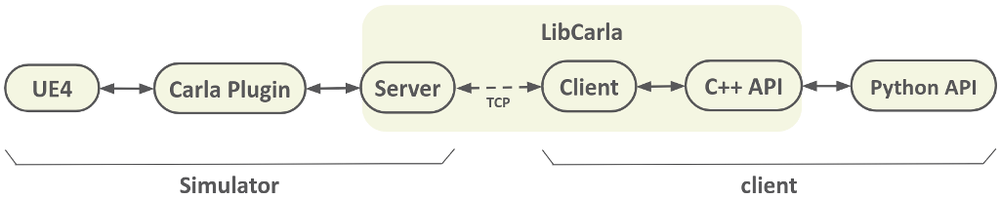

# 如何添加新传感器

本教程介绍了向 CARLA 添加新传感器的基础知识。它提供了在虚幻引擎 4 (UE4) 中实现传感器并通过 CARLA 的 Python API 公开其数据的必要步骤。我们将以创建一个新传感器为例来演示所有步骤。

*   [__先决条件__](#prerequisites)  
*   [__介绍__](#introduction)  
*   [__创建新传感器__](#creating-a-new-sensor)  
	*   [1- 传感器角色](#1-sensor-actor)  
	*   [2- 传感器数据序列化器](#2-sensor-data-serializer)  
	*   [3- 传感器数据对象](#3-sensor-data-object)  
	*   [4- 注册您的传感器](#4-register-your-sensor)  
	*   [5- 使用示例](#5-usage-example)  
*   [__附录__](#appendix)  
	*   [重复使用缓冲区](#reusing-buffers)  
	*   [异步发送数据](#sending-data-asynchronously)  
	*   [客户端传感器](#client-side-sensors)  

---
## 先决条件

为了实现新传感器，您需要编译 CARLA 源代码，有关如何实现此操作的详细说明，请参见[从源码构建](build_linux.md)。

本教程还假设读者熟悉 C++ 编程。

---
## 介绍

CARLA 中的传感器是一种特殊类型的角色，它们生成数据流。某些传感器连续生成数据，每次更新传感器时都会生成；其他传感器仅在发生某些事件后才生成数据。例如，相机在每次更新时都会生成图像，但碰撞传感器仅在发生碰撞时才触发。

虽然大多数传感器在服务器端 (UE4) 计算测量值，但值得注意的是，有些传感器仅在客户端运行。此类传感器的一个例子是车道侵入传感器 (LaneInvasion)，它在每次跨越车道标记时发出通知。有关更多详细信息，请参见[附录：客户端传感器](#appendix-client-side-sensors)。

在本教程中，我们将专注于服务器端传感器。

为了让运行在 UE4 内部的传感器将数据一路发送到 Python 客户端，我们需要涵盖整个通信管道。



1.  **传感器 (UE4)**：由于传感器是角色，因此此代码必须位于 UE4 模块下（通常在 `Unreal/CarlaUE4/Plugins/Carla/Source/Carla/Sensor`）。
2.  **序列化器 (LibCarla)**：我们需要在 `LibCarla` 中编写一个序列化类，将 UE4 传感器生成的数据准备好在网络上传输。
3.  **数据对象 (LibCarla)**：我们需要在 `LibCarla` 中编写一个数据对象类，用于在 Python 客户端表示传感器数据。
4.  **注册 (Unreal/LibCarla)**：我们需要在传感器的 UE4 角色和其在 LibCarla 中的表示之间建立链接。
5.  **Python 接口**：我们需要在 Python 中暴露数据对象（使用 Boost.Python）。

在接下来的部分中，我们将通过实施一个新的 **“光学速度计”** 传感器来介绍这些步骤。该传感器是一个非常简单的传感器，每次更新都会向客户端发送其在世界坐标系中的当前速度。

---
## 创建新传感器

### 1- 传感器角色

传感器在 UE4 中是一个角色。由于我们的新传感器非常基础，我们可以让它继承自 `ASensor`。如果我们想编写一个基于场景渲染组件的相机，我们将继承自 `ASceneCaptureSensor`。有关其他可能的基类，请查看 `Unreal/CarlaUE4/Plugins/Carla/Source/Carla/Sensor`。

在 `Unreal/CarlaUE4/Plugins/Carla/Source/Carla/Sensor` 下创建 `OpticalSpeedometer.h`：

```cpp
#pragma once

#include "Carla/Sensor/Sensor.h"
#include "OpticalSpeedometer.generated.h"

UCLASS()
class CARLAUE4_API AOpticalSpeedometer : public ASensor
{
  GENERATED_BODY()

public:

  AOpticalSpeedometer(const FObjectInitializer& ObjectInitializer);

  // 此函数是必须实现的，因为 ASensor::Tick 会在每帧结束时调用它。
  void Tick(float DeltaSeconds) override;
};
```

以及相应的 `OpticalSpeedometer.cpp`：

```cpp
#include "Carla.h"
#include "Carla/Sensor/OpticalSpeedometer.h"
#include "Carla/Sensor/SensorDataView.h"

// 包含 LibCarla 端的头文件以获取数据。
#include <carla/sensor/data/OpticalSpeedometerData.h>

AOpticalSpeedometer::AOpticalSpeedometer(const FObjectInitializer& ObjectInitializer)
  : Super(ObjectInitializer)
{
  // 我们的传感器每帧只生成一次数据，
  // 因此我们可以禁用 UE4 的 Tick，
  // 并让 ASensor 的 Tick 处理它。
  PrimaryActorTick.bCanEverTick = false;
}

void AOpticalSpeedometer::Tick(float DeltaSeconds)
{
  Super::Tick(DeltaSeconds);

  // 获取我们想通过网络发送的数据。
  FVector Velocity = GetVelocity();

  // 我们使用传感器流（由 ASensor 提供）向 LibCarla 端的序列化器发送数据。
  auto DataStream = GetDataStream(*this);
  DataStream.Send(*this, Velocity);
}
```

> [!注意]
> 如果您的传感器是基于事件的，或者您想根据需要发送数据，您可以在任何时候调用 `DataStream.Send(*this, ...)`。

### 2- 传感器数据序列化器

现在我们需要在 `LibCarla` 中创建一个序列化器，用于通过网络传输我们的数据。序列化器最重要的函数是 `Serialize`。该函数将在网络缓冲区准备好发送之前调用。它接收 `ASensor` 作为参数，以便我们可以访问它的属性，并接收数据。

在 `LibCarla/source/carla/sensor/s11n` 中创建 `OpticalSpeedometerSerializer.h`：

```cpp
#pragma once

#include <carla/sensor/RawData.h>

namespace carla {
namespace sensor {

  class Sensor;

namespace s11n {

  class OpticalSpeedometerSerializer {
  public:

    // 此函数负责通过网络发送数据。
    // 它接收发送到 GetDataStream(*this).Send(...) 的所有参数。
    template <typename SensorT, typename... ArgsT>
    static void Serialize(const SensorT &sensor, Buffer &&buffer, ArgsT &&... args) {
      // 在这里实现如何对数据进行序列化。
    }

    // 此函数是在从网络缓冲区重建数据对象之前调用的。
    static SharedPtr<SensorData> Deserialize(RawData &&data);
  };

} // namespace s11n
} // namespace sensor
} // namespace carla
```

对于我们的示例，`Serialize` 函数将非常简单，因为我们要发送的数据（一个 `FVector`）可以通过网络直接以内存拷贝的方式发送。由于 `FVector` 有三个浮点数，我们可以将其强制转换为 `carla::geom::Vector3D`（它也有三个浮点数）。

```cpp
    template <typename SensorT>
    static void Serialize(
        const SensorT &,
        Buffer &&buffer,
        const FVector &velocity) {
      geom::Vector3D data{velocity.X, velocity.Y, velocity.Z};
      buffer.copy_from(data);
    }
```

现在我们需要实现 `Deserialize` 函数。该函数将由 Python API 端的客户端调用，将原始缓冲区转换回我们的传感器数据对象。

```cpp
    static SharedPtr<SensorData> Deserialize(RawData &&data) {
      return MakeShared<data::OpticalSpeedometerData>(std::move(data));
    }
```

稍后我们将编写 `data::OpticalSpeedometerData`。

### 3- 传感器数据对象

现在我们需要编写在客户端表示传感器数据的对象。此类应继承自 `SensorData`。

在 `LibCarla/source/carla/sensor/data` 下创建 `OpticalSpeedometerData.h`：

```cpp
#pragma once

#include <carla/sensor/SensorData.h>

namespace carla {
namespace sensor {
namespace data {

  class OpticalSpeedometerData : public SensorData {
  public:

    explicit OpticalSpeedometerData(RawData &&data)
      : SensorData(std::move(data)) {
      // 重构数据对象的逻辑。
    }

  private:

    geom::Vector3D _velocity;
  };

} // namespace data
} // namespace sensor
} // namespace carla
```

我们的数据对象只包含一个向量。在构造函数中，我们可以从原始缓冲区中检索它。

```cpp
    explicit OpticalSpeedometerData(RawData &&data)
      : SensorData(std::move(data)) {
      assert(GetRawData().size() == sizeof(geom::Vector3D));
      std::memcpy(&_velocity, GetRawData().data(), sizeof(geom::Vector3D));
    }
```

最后，我们需要添加一个获取器以便我们可以从 Python 访问此速度。

```cpp
    const geom::Vector3D &GetVelocity() const {
      return _velocity;
    }
```

### 4- 注册您的传感器

现在我们需要建立所有部分之间的连接。

首先，在 `LibCarla/source/carla/sensor/SensorRegistry.h` 中注册序列化器：

```cpp
#include <carla/sensor/s11n/OpticalSpeedometerSerializer.h>
// ... 其他包含 ...

// ... 在注册表模板参数列表中添加我们的传感器 ...
    S11N_SENSORS(
        OpticalSpeedometerSerializer,
        // ...
```

这将为我们的新传感器自动分配一个唯一 ID。

接下来，由于我们使用的是 UE4 类型（`ASensor` 和 `FVector`），我们需要将它们添加到 `Unreal/CarlaUE4/Plugins/Carla/Source/Carla/Sensor/SensorFactory.cpp` 的重载列表中：

```cpp
#include <carla/sensor/s11n/OpticalSpeedometerSerializer.h>
// ... 其他包含 ...

// ... 在适当的位置添加重载 ...
void ASensorFactory::RegisterSensor(ASensor &Sensor) {
  // ...
  if (Cast<AOpticalSpeedometer>(&Sensor)) {
    Sensor.SetDataStream<carla::sensor::s11n::OpticalSpeedometerSerializer>(Sensor);
  }
  // ...
}
```

### 5- 使用示例

最后一步是将我们的传感器和数据对象暴露给 Python。

在 `PythonAPI/carla/source/libcarla/SensorData.cpp` 中公开传感器数据类：

```cpp
#include <carla/sensor/data/OpticalSpeedometerData.h>
// ... 其他包含 ...

void export_sensor_data() {
  using namespace carla::sensor::data;
  // ... 其他导出 ...

  class_<OpticalSpeedometerData, bases<SensorData>, SharedPtr<OpticalSpeedometerData>>("OpticalSpeedometerData", no_init)
    .add_property("velocity", make_function(&OpticalSpeedometerData::GetVelocity, return_value_policy<copy_const_reference>()))
    .def("__str__", &OpticalSpeedometerData::ToString)
  ;

  // ...
}
```

并在 `PythonAPI/carla/source/libcarla/Blueprint.cpp` 中将传感器 ID 添加到蓝图库，以便可以从 Python 中找到它：

```cpp
// 在适当的位置添加 ID：
// ...
  { "sensor.other.optical_speedometer", "optical_speedometer" },
// ...
```

现在编译，您应该能够从 Python 脚本中使用此新传感器：

```python
# 生成传感器
speedometer_bp = blueprint_library.find('sensor.other.optical_speedometer')
speedometer = world.spawn_actor(speedometer_bp, carla.Transform(), attach_to=my_vehicle)

# 注册回调
def on_speed_measured(data):
    print("速度：%s" % data.velocity)

speedometer.listen(on_speed_measured)
```

---

## 附录

### 重复使用缓冲区

为了提高性能，有时您可能希望重用内存缓冲区，而不是为每个传感器测量值分配新的缓冲区。

`GetDataStream` 允许传递一个可选的 `Buffer` 对象：

```cpp
  auto DataStream = GetDataStream(*this, MyReusableBuffer);
```

在这种情况下，`Serialize` 函数将接收对此缓冲区的引用，您可以直接在其上写入。

### 异步发送数据

某些传感器可能需要一些时间来计算数据，您可能不想在 `Tick` 中阻塞主线程。

`GetDataStream` 的 `Send` 函数是线程安全的。您可以在任何工作线程中调用它。

```cpp
  // 在工作线程中调用此函数。
  auto DataStream = GetDataStream(*this);
  DataStream.Send(*this, DataToPost);
```

### 客户端传感器

某些传感器完全在客户端执行。这意味着它们不通过网络从服务器接收数据。相反，它们在 Python 端计算所需的信息。

为了创建一个客户端传感器，您需要从 `Sensor` 类继承并在 Python API 中公开它。

例如，在 `PythonAPI/carla/source/libcarla/Sensor.cpp` 中：

```cpp
class_<ClientSideSensor, bases<Sensor>, SharedPtr<ClientSideSensor>>("ClientSideSensor", no_init)
  .def("listen", &ClientSideSensor::Listen)
  // ...
;
```

这些传感器通常利用 `world.on_tick` 或传感器的 `listen` 回调来获取必要的信息并向用户发出通知。
